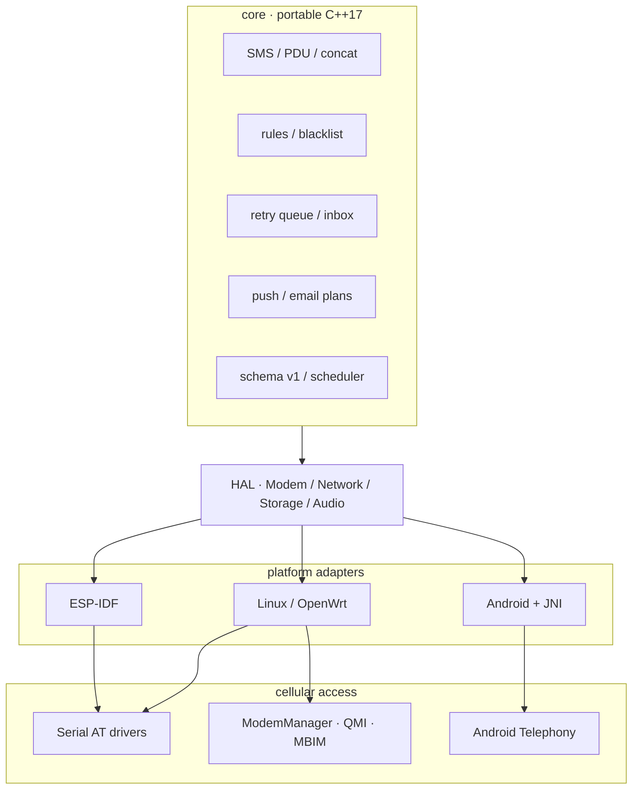

<div align="center">

# OmniSMS

### 一份核心，任意设备。

跨 ESP32、Linux、OpenWrt 与 Android 的短信、来电与蜂窝事件转发平台。

[](https://github.com/MineSunshineone/OmniSMS/actions/workflows/ci.yml)
[](LICENSE)
[](core)
[](ports/esp-idf)
[](ports/android)
[](ports/linux)

[快速开始](#快速开始) · [平台状态](#平台状态) · [系统架构](#系统架构) · [功能矩阵](#功能矩阵) · [生产部署](#生产部署) · [开发路线](#开发路线)

</div>

---

OmniSMS 将短信解析、转发规则、消息状态、推送协议和调度逻辑集中在同一套可移植核心中，
再通过平台适配层连接不同硬件与操作系统。项目由在役的
[sms_forwarding](https://github.com/MineSunshineone/sms_forwarding) 固件演进而来，
并以 **ESP32-C3 + ML307R-DC** 作为功能和 Web UI 的回归基准。

> [!IMPORTANT]
> 项目正处于跨平台迁移与硬件回归阶段。主机测试、Linux 构建、ESP-IDF 构建和 Android APK
> 构建均已有验证记录；标记为“待实机验证”的能力不等同于已经通过真实运营商网络验收。

## 为什么选择 OmniSMS

| 能力 | 说明 |
|---|---|
| **真正的共享核心** | PDU、长短信、号码处理、规则、队列、收发件箱、管理员命令、调度和邮件内容由同一套 C++17 实现提供。 |
| **多平台运行** | 同一配置模型面向 ESP-IDF、Linux/OpenWrt 和 Android；平台代码只负责硬件、系统权限与 I/O。 |
| **两类 Linux 蜂窝接入** | 支持直接控制串口 AT 模组，也支持由 ModemManager 管理的 USB、QMI、MBIM 类设备。 |
| **成熟的通知能力** | 支持 Webhook、Bark、Telegram、钉钉、飞书、Gotify、PushPlus、Server酱、自定义模板与 SMTP。 |
| **保留原项目体验** | 共享 `webui/` 与 ESP32 基准源码逐文件保持一致；Linux 直接托管同一套管理界面。 |
| **诚实的能力声明** | 每个平台和 driver 明确区分已实现、部分实现、待验证与不支持，不伪造硬件能力。 |

## 平台状态

状态说明：✅ 已实现并有自动化验证 · 🚧 已实现或迁移，等待真实设备回归 · 📋 计划中

| 平台 | 目标设备 | 当前状态 |
|---|---|---|
| **ESP-IDF** | ESP32-C3 + ML307R-DC；后续扩展 ESP32/S3/C3 与其他 AT 模组 | 🚧 完整固件已迁入并构建通过；号码、规则、推送、PDU、长短信、队列和配置已消费共享 core，待逐功能实机回归。 |
| **Linux / Serial AT** | 树莓派、Debian 随身 WiFi、USB 串口模组 | 🚧 短信收发、URC、来电、USSD、SIM 热插拔、Web、SMTP、调度与推送已实现，待真模组验证。 |
| **Linux / ModemManager** | QMI/MBIM/USB 4G/5G 模组、由系统管理的蜂窝设备 | 🚧 `mmcli`/D-Bus 后端、多设备发现与显式选择、短信、USSD、SIM 状态、来电提醒和重置已实现并通过无硬件测试，待真实设备验证。 |
| **OpenWrt** | 4G 路由器与 UFI 类设备 | 🚧 软件包 Makefile 与 procd 服务骨架就绪，待 buildroot 和设备回归。 |
| **Android** | Android 8.0+ 插卡手机 | 🚧 Kotlin + JNI + Telephony + WorkManager 已构建；原生控制台已对齐 Web 视觉，待真机权限、多卡与后台保活回归。 |

最新、可恢复的工程进度记录在 [docs/progress/STATUS.md](docs/progress/STATUS.md)。

## 快速开始

### 环境要求

| 组件 | 要求 |
|---|---|
| CMake | 3.16+ |
| C++ 编译器 | 支持 C++17 的 GCC/Clang/MinGW |
| Linux HTTP/TLS | libcurl development package |
| Serial AT | 可读写的稳定串口路径，推荐 `/dev/serial/by-id/` |
| ModemManager | `mmcli` + 已被 ModemManager 识别的 modem |

### 1. 构建共享核心与测试

```bash
git clone https://github.com/MineSunshineone/OmniSMS.git
cd OmniSMS

cmake -S . -B build -DOMNISMS_BUILD_TESTS=ON
cmake --build build -j
ctest --test-dir build --output-on-failure
```

### 2. 构建 Linux 守护进程

Debian / Ubuntu：

```bash
sudo apt update
sudo apt install -y cmake g++ libcurl4-openssl-dev

cmake -S . -B build \
  -DOMNISMS_BUILD_TESTS=ON \
  -DOMNISMS_BUILD_LINUX_PORT=ON
cmake --build build -j
ctest --test-dir build --output-on-failure
```

准备配置并启动：

```bash
sudo install -d /etc/omnisms /var/lib/omnisms
sudo install -m 600 ports/linux/omnisms.json.example /etc/omnisms/omnisms.conf
sudo editor /etc/omnisms/omnisms.conf

./build/ports/linux/omnismsd -c /etc/omnisms/omnisms.conf
```

默认 Web 地址为 `http://127.0.0.1:8080/`。直接暴露到公网前，请修改默认凭据并优先通过
反向代理、VPN 或 Tailscale 提供访问。

### 3. 不接硬件验证消息管道

```bash
./build/ports/linux/omnismsd \
  -c ports/linux/tests/minimal.json \
  --test-pdu 00040D91683108108300F000006270012100002305E8329BFD06
```

### 4. 发送短信或查询 USSD

```bash
./build/ports/linux/omnismsd -c /etc/omnisms/omnisms.conf \
  --send-sms +8613800138000 "测试短信"

./build/ports/linux/omnismsd -c /etc/omnisms/omnisms.conf \
  --ussd '*100#'
```

## Linux 蜂窝后端

### 串口 AT

适用于项目直接拥有 AT 串口的设备。建议使用 `/dev/serial/by-id/` 下的稳定路径，避免
`ttyUSB*` 编号在重启后漂移。

```json
{
  "modem": {
    "driver": "generic-3gpp",
    "endpoint": "/dev/serial/by-id/your-modem-port",
    "baud": 115200,
    "pollIntervalMs": 3000
  }
}
```

### ModemManager

适用于已经由系统 ModemManager 管理的 QMI、MBIM 或 USB 蜂窝设备。OmniSMS 通过
`mmcli` 使用 ModemManager D-Bus，不与系统服务争抢 AT 串口。

```bash
sudo apt install -y modemmanager
sudo systemctl enable --now ModemManager
mmcli -L

# 也可以通过 OmniSMS 的诊断入口列出规范 D-Bus 路径：
./build/ports/linux/omnismsd --list-modems
```

只有一个 modem 时可使用自动选择：

```json
{
  "modem": {
    "driver": "modemmanager",
    "endpoint": "auto",
    "baud": 115200,
    "pollIntervalMs": 3000
  }
}
```

存在多个 modem 时，必须将 `endpoint` 设置为 `mmcli -L` 输出的数字 ID 或完整 D-Bus 对象路径，
防止消息从错误的 SIM 发出。后端会在启动时探测 Messaging、3GPP-USSD 和 Voice 接口，并按
实际接口动态声明能力；当前支持短信收发、USSD、SIM 状态、Voice/Call 来电提醒和 modem 重置。
原始 AT 终端在 ModemManager 持有设备时明确不支持。

## 系统架构



架构边界位于“统一短信/来电事件”，而不是某一种 AT 命令：串口平台使用 core 的 PDU
组件，ModemManager 与 Android Telephony 则直接提供完整短信。详细端口约定见
[docs/porting.md](docs/porting.md)。

Linux 串口内部继续保留 `AtChannel` 与自注册 `ModemDriver` 边界。新增 AT 模组系列只需增加
`ports/linux/src/drivers/<name>.cpp`，不修改 core、Linux 主入口或 CMake 文件。

## 配置与 Web 管理

所有平台共享 [docs/config.schema.json](docs/config.schema.json) 定义的 schema v1。配置可在设备间迁移，
Linux 同时兼容原 ESP 固件导出的 `key = value` 格式。

Linux Web 后端直接托管未改样式的 `webui/`，并提供：

- 设备状态、收件箱、删除与手动重发；
- 分域保存、schema v1 导入导出与旧配置导入；
- 短信发送、USSD 与串口 AT 终端；
- Basic Auth、CSRF 校验与运行时配置热加载；
- 临时文件 + `fsync` + 原子重命名的配置写回。

推送、SMTP、规则、调度和 Web 凭据可热加载。modem driver、设备端点、波特率或监听地址变化
需要重启服务；调度运行状态保存在配置旁的 `.state` sidecar 中。

## 生产部署

默认 CMake 安装前缀为 `/usr/local`，与仓库提供的 systemd 服务一致：

```bash
sudo cmake --install build
sudo install -m 644 ports/linux/omnisms.service /etc/systemd/system/omnisms.service
sudo systemctl daemon-reload
sudo systemctl enable --now omnisms

systemctl status omnisms
journalctl -u omnisms -f
```

默认安装结果：

| 内容 | 路径 |
|---|---|
| 守护进程 | `/usr/local/bin/omnismsd` |
| Web UI | `/usr/local/share/omnisms/webui/` |
| 主配置 | `/etc/omnisms/omnisms.conf` |
| 消息状态 | 由 `storage.inboxFile` 和对应状态文件决定 |

配置文件扩展名虽为 `.conf`，内容仍可使用统一 schema v1 JSON；守护进程会自动识别 JSON 与旧版
`key = value` 格式。

## 功能矩阵

状态：✅ 已实现 · 🚧 已实现但待目标设备端到端验证 · 📋 计划 · — 不支持

| 功能 | ESP-IDF | Linux AT | Linux ModemManager | Android |
|---|---:|---:|---:|---:|
| 短信接收 | 🚧 PDU/长短信 | 🚧 PDU/URC | 🚧 完整文本短信 | 🚧 Telephony |
| 短信发送 | 🚧 | ✅ CLI/Web | 🚧 CLI/Web | 🚧 SmsManager |
| 10 类 HTTP 推送 | 🚧 | ✅ | ✅ | 🚧 |
| SMTP | 🚧 | ✅ TLS/STARTTLS | ✅ TLS/STARTTLS | 🚧 TLS/STARTTLS |
| 来电提醒 | 🚧 | 🚧 `RING/+CLIP` | 🚧 Voice/Call 轮询 | 🚧 `PHONE_STATE` |
| USSD | 🚧 | ✅ | 🚧 | 🚧 |
| SIM 热插拔/状态 | 🚧 | 🚧 `AT+CPIN?` | 🚧 ModemManager | 🚧 系统管理 |
| 管理员 `SMS:` / `RESET` | 🚧 | 🚧 | 🚧 | 🚧；设备 RESET 无普通 APK 权限 |
| 固定容量收发件箱 | ✅ core + NVS | ✅ core + Web | ✅ core + Web | ✅ core + SharedPreferences |
| 保号、心跳与周期任务 | 🚧 | 🚧 | 🚧 | 🚧 WorkManager |
| 共享 Web UI | ✅ | ✅ | ✅ | — 原生 UI 复用设计令牌 |
| eSIM/eUICC | 🚧 基准源码 | 📋 | 📋 | — 普通 APK 无切换权限 |
| WiFi Calling | — | 📋 | 📋 | 📋 |

## 推送通道

| 类型 | 支持 | 类型 | 支持 |
|---|---:|---|---:|
| 通用 POST JSON / GET | ✅ | Bark | ✅ |
| Telegram | ✅ | 钉钉机器人 | ✅ |
| 飞书机器人 | ✅ | Gotify | ✅ |
| PushPlus | ✅ | Server酱 | ✅ |
| 自定义模板 | ✅ | SMTP 邮件 | ✅ |

## 蜂窝模组路线

OmniSMS 按“具体系列 + 接入方式 + 能力矩阵”推进，不承诺整个品牌天然兼容。

| 优先级 | 模组系列 | 接入策略 |
|---|---|---|
| **P0** | ML307R-DC | ESP32-C3 功能与硬件回归基准。 |
| **P1** | EC200U、EC800M/EC800G | Quectel AT driver。 |
| **P1** | A7670、SIM7600 | MCU 使用 AT；Linux 优先 ModemManager/QMI/MBIM。 |
| **P1** | Air780E/Air780EPM | 先支持外置 AT；LuatOS/CSDK 作为独立平台端口评估。 |
| **P2** | L610/L716、FM650 | AT 或 ModemManager，按具体设备接口选择。 |
| **P2** | N58/N720 | 独立 Neoway AT driver。 |
| **P3** | BG95/BG96、SIM7070、RM500Q/RM520N | 按运营商短信/语音能力与 Linux 场景推进。 |

每个 driver 必须分别声明 PDU 短信、来电、USSD、SIM 热插拔、PDP/APN、重启、eSIM 和语音能力；
未支持的操作必须返回 `unsupported`，不能伪实现。

## 仓库结构

```text
omnisms/
├── core/                 # 平台无关 C++17 核心
├── ports/
│   ├── esp-idf/          # ESP32-C3 + ML307R-DC 固件基线
│   ├── linux/            # Linux daemon、AT 与 ModemManager 后端
│   ├── openwrt/          # OpenWrt package / procd
│   └── android/          # Kotlin、JNI、Telephony、WorkManager
├── webui/                # ESP/Linux 共享 Web UI
├── tests/                # 零依赖 host 单元测试
├── docs/
│   ├── config.schema.json
│   ├── porting.md
│   └── progress/         # 可恢复的开发进度与验证证据
└── omniSMS_codex_prompt.md
```

## 其他平台

### ESP32

构建、烧录、分区与基准回归说明见 [ports/esp-idf/README.md](ports/esp-idf/README.md)。

### Android

```powershell
cd ports/android
.\gradlew.bat assembleDebug
```

Debug APK 输出到 `ports/android/app/build/outputs/apk/debug/app-debug.apk`。权限、后台服务、
多卡与 UI 回归说明见 [ports/android/README.md](ports/android/README.md)。

### OpenWrt

软件包文件位于 [ports/openwrt](ports/openwrt)。当前仍需要在具体 SDK/buildroot 与目标设备上验证。

## 开发路线

- [x] 共享 core：PDU、长短信、号码、规则、文本与推送报文。
- [x] 统一配置 schema v1、旧配置导入和跨平台映射。
- [x] 固定容量重试队列、收发件箱、管理员命令、调度与邮件内容。
- [x] Linux Serial AT 后端、独立 URC、短信、来电、USSD 与 SIM 状态。
- [x] Linux Web 管理、原子配置写回、热加载、SMTP 和多通道推送。
- [x] Linux ModemManager：多设备发现/选择、动态能力探测、短信、USSD、SIM 状态、来电提醒与重置。
- [x] ESP32-C3 + ML307R-DC 完整固件迁入并通过 ESP-IDF 构建。
- [x] Android APK、JNI core、Telephony、WorkManager 与统一视觉组件。
- [ ] ESP32-C3 + ML307R-DC 逐功能实机回归。
- [ ] Linux Serial AT 与 ModemManager 真实模组/运营商回归。
- [ ] Android 插卡真机、多卡、后台保活与厂商限制回归。
- [ ] P1 AT drivers：Quectel、SIMCom、Air780E 外置 AT。
- [ ] ModemManager 完整通话管理与并发多 modem 运行策略。
- [ ] eSIM/eUICC 与 WiFi Calling 独立调研和分平台实现。

## 验证状态

当前仓库记录的最近一次本地验证包括：

- Ninja/MinGW host tests：`9/9`；
- WSL/Linux 完整测试：`18/18`，其中 3 项通过 fake `mmcli` 真实执行 `fork/exec` CLI 管道；
- ESP-IDF 5.5.4 `esp32c3` 完整固件构建通过；
- Android API 36 / NDK r28b `assembleDebug` 通过，四个 ABI 的 JNI/core 已编译。

这些结果验证构建与自动化逻辑，不替代 ESP、真实蜂窝模组和插卡 Android 手机的实机验收。

## 参与开发

欢迎提交 Issue、硬件回归结果和 Pull Request。开始前建议先阅读：

1. [端口开发指南](docs/porting.md)；
2. [当前开发状态](docs/progress/STATUS.md)；
3. [阶段 0 调研与许可证结论](docs/progress/2026-07-10-stage0.md)。

提交新 modem driver 时，请同时提供能力声明、AT/系统接口证据、测试向量、失败时的
`unsupported` 行为，以及 README/进度文档更新。

> [!WARNING]
> SimAdmin 使用 GPLv3，而 OmniSMS 当前使用 MIT。在许可证策略明确前，只进行功能与接口调研，
> 不直接复制 GPLv3 代码。

## 常见问题

<details>
<summary><strong>为什么 ModemManager 模式无法使用原始 AT 终端？</strong></summary>

ModemManager 已拥有设备控制权。OmniSMS 会明确返回 unsupported，避免两个进程同时操作 AT
端口导致短信丢失或 modem 状态异常。需要直接 AT 时请停用 ModemManager，并改用 Serial AT backend。

</details>

<details>
<summary><strong>系统中有多个 modem，应该如何选择？</strong></summary>

运行 `omnismsd --list-modems`，然后把 `modem.endpoint` 设置为数字 ID 或完整 D-Bus 对象路径。
多设备存在时不会接受 `auto`，防止从错误的 SIM 发送短信。

</details>

<details>
<summary><strong>Web 页面为什么只能在本机访问？</strong></summary>

默认监听 `127.0.0.1:8080` 是安全选择。需要远程访问时，推荐使用反向代理、VPN 或 Tailscale，
并先修改默认 Web 凭据；不要直接把弱口令管理页面暴露到公网。

</details>

## License

OmniSMS 采用 [MIT License](LICENSE)。core 逻辑演进自
[chenxuuu/sms_forwarding](https://github.com/chenxuuu/sms_forwarding)，PDU 编解码包含来自
[mgaman/PDUlib](https://github.com/mgaman/PDUlib) 的 MIT 许可代码。第三方来源与许可证说明以仓库文件为准。

---

<div align="center">

**OmniSMS — one core, every device.**

</div>
